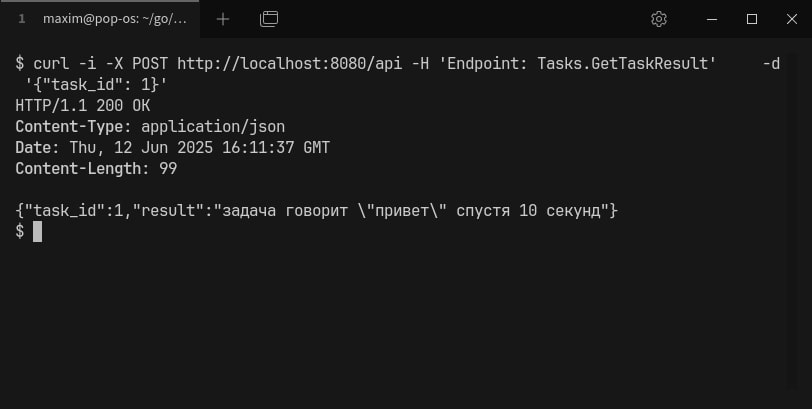

# Task API

## Запуск

### Опция 1 - Go toolchain

На Linux:

```bash
cd ./cmd/api
go build -o ./bin/main .
bin/main
```

На Windows:

```bash
cd ./cmd/api
go build -o ./bin/main.exe .
./bin/main.exe
```

### Опция 2 - Docker

```bash
docker build . -t task-api-aszxqaz
docker run task-api-aszxqaz -p 8080=8080
```

## Примеры использования

#### Создать задачу `waiting`

```bash
curl -i -X POST http://localhost:8080/api -H 'Endpoint: Tasks.CreateTask' \
    -d '{"task_type": "waiting", "options": { "duration_sec": 20 }}'
```


#### Получить детали задачи:

```bash
curl -i -X POST http://localhost:8080/api -H 'Endpoint: Tasks.GetTaskDetails' \
    -d '{"task_id": 1}'
```


#### Получить список задач:

```bash
curl -i -X POST http://localhost:8080/api -H 'Endpoint: Tasks.ListTasks'
```


#### Получить результаты выполнения задачи:

```bash
curl -i -X POST http://localhost:8080/api -H 'Endpoint: Tasks.GetTaskResult' \
    -d '{"task_id": 1}'
```



#### Отменить задачу

```bash
curl -i -X POST http://localhost:8080/api -H 'Endpoint: Tasks.CancelTask' \
    -d '{"task_id": 1}'
```


#### Удалить задачу

```bash
curl -i -X POST http://localhost:8080/api -H 'Endpoint: Tasks.DeleteTask' \
    -d '{"task_id": 1}'
```


